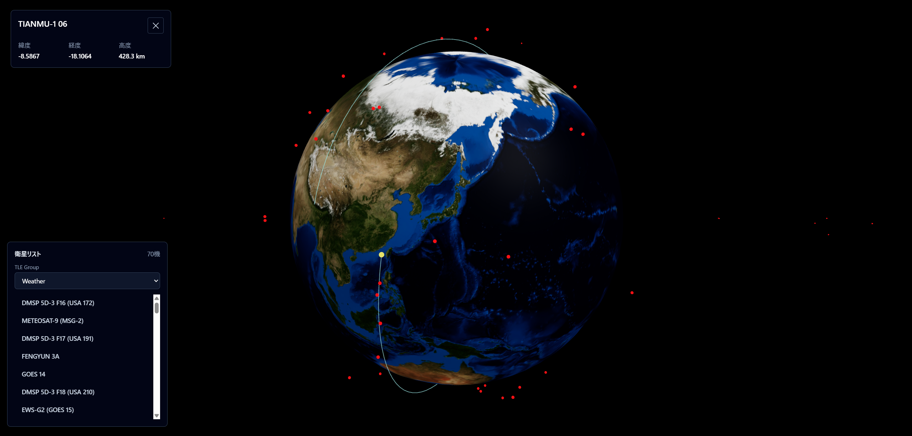
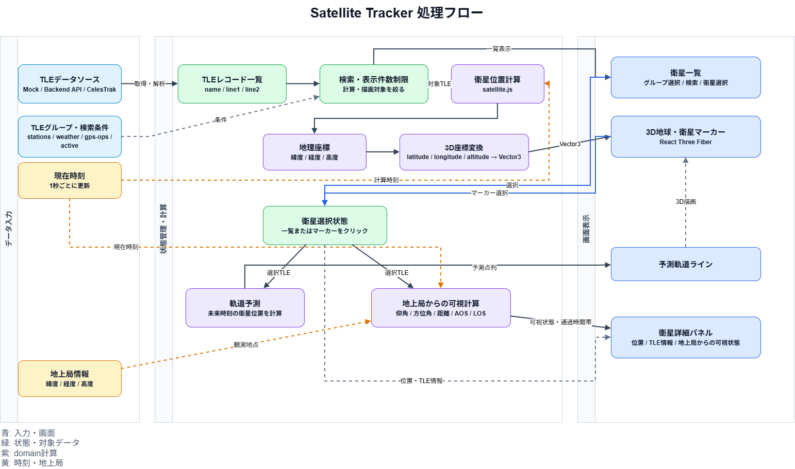

# Satellite Tracker

TLEデータをもとに衛星の現在位置・予測軌道・地上局からの可視時間帯を計算し、3D地球上に可視化するWebアプリケーションです。

TLE解析、衛星位置計算、地上局からの可視判定、3D可視化、Reactアプリケーション設計を学習・実装しています

## Features

- TLEデータから衛星の現在位置を計算
- satellite.jsによる緯度・経度・高度の算出
- React Three Fiberによる3D地球表示
- 衛星マーカーのリアルタイム更新
- 選択した衛星の詳細情報表示
- 選択した衛星の予測軌道ライン表示
- 地上局から見た衛星の可視状態を表示
  - 仰角
  - 方位角
  - 距離
  - AOS / LOS
  - 最大仰角
  - 可視時間帯
- TLEグループ切り替え
  - Space Stations
  - Weather
  - GPS Operational
  - Active Satellites
- 衛星一覧からの選択
- 衛星名検索
- 表示件数制限による描画負荷の抑制
- CelesTrakの過剰アクセス制限を避けるためのモックTLE対応
- TLEデータの基準時刻表示
- TLE取得結果のキャッシュ(server側で実施)


## デモ

[Satellite Tracker](https://kumakichi1106.github.io/satellite-tracker/)



## 開発

```bash
yarn install
yarn dev
```

## ビルド

```bash
yarn build
```

## 設計思想

本プロジェクトでは、実務での保守性や機能追加を意識してレイヤーを分離しています。

API通信、ドメインロジック、状態管理、表示コンポーネントを分けることで、変更箇所を追いやすくし、チーム開発でも扱いやすい構成を目指しています。

Context Providerでアプリ全体の衛星データと選択状態を管理し、Container ComponentでContextの値を取得してPresentational Componentへ受け渡す構成にしています。

衛星位置計算や可視時間帯計算など、アプリケーションの中心となる処理はdomainに配置し、UIから切り離しています。

## フォルダ構成

```text
src/
  App.tsx
  main.tsx
  layout/               # 画面全体のレイアウト
  components/
    earth-viewer/        # 3D地球・衛星マーカー・軌道線の表示
    orbit-line/          # 軌道予測ライン
    satellite-info/      # 選択中衛星の詳細表示
    satellite-list/      # 衛星一覧・TLEグループ選択・検索
    satellite-marker/    # 衛星マーカー
    tle-group-selector/  # TLEグループ選択UI
    icons/               # アイコンコンポーネント
    ui/                  # 汎用UIコンポーネント
  constants/             # TLEグループ、API URL、地上局などの定数
  contexts/              # アプリ全体の衛星状態管理
  dataModel/             # TLE、衛星位置、軌道予測、可視判定のデータモデル
  domain/                # 衛星位置計算、座標変換、軌道予測、可視時間帯計算
  hooks/                 # Reactとdomain/infrastructureを接続する処理
  infrastructure/        # CelesTrak API通信、モックTLE
  ```

## 技術スタック

- React 19
- TypeScript
- Vite
- Tailwind CSS
- Three.js
- React Three Fiber
- @react-three/drei
- satellite.js
- CelesTrak GP data
- Vitest

## 処理フロー

TLEデータの取得から衛星位置計算、3D描画、軌道予測、地上局からの可視時間帯計算までの流れを示します。



編集用ファイル：[draw.io形式](./docs/diagrams/satellite-tracker-processing-flow.drawio)

## Notes

現在はCelesTrakへの過剰アクセスを避けるため、モックTLEデータを利用しています。

実APIに切り替える場合は、`src/infrastructure/celestrakClient.ts` の `USE_MOCK_TLE` を変更します。

ただし、CelesTrakは短時間の過剰アクセスでIP制限されるため、実APIを利用する場合は以下の対策が必要です。

- TLEグループごとの件数制限
- activeのような大規模グループの検索・絞り込み
- 不必要な再取得の抑制
- キャッシュによるAPIアクセス回数の削減

## Future Work

- 選択衛星へのカメラフォーカス
- 観測地点ごとの衛星可視予測
- 衛星軌道変更シミュレーター